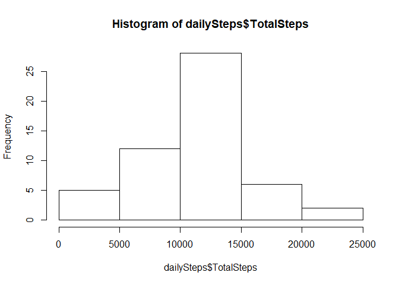
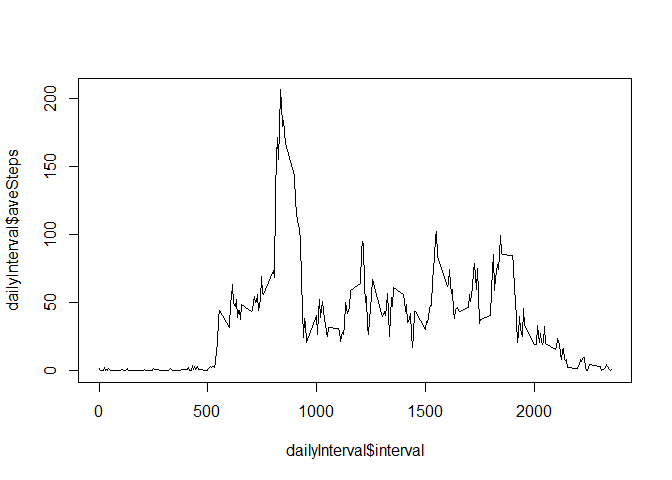
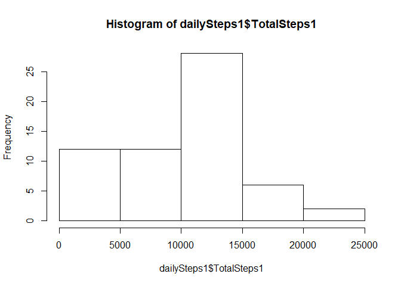
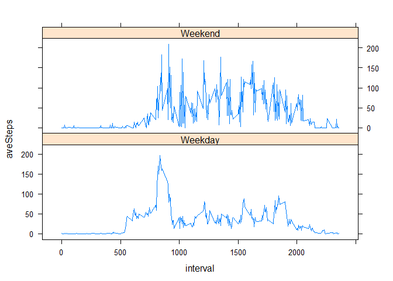

## Loading and preprocessing the data


## What is mean total number of steps taken per day?
 1. Calculate the total number of steps taken per day.


```r
##Create daily steps using group by
dailySteps<-activity%>%group_by(date)%>%summarize(TotalSteps = sum(steps))

dailySteps
```

```
## # A tibble: 61 x 2
##    date       TotalSteps
##    <date>          <int>
##  1 2012-10-01         NA
##  2 2012-10-02        126
##  3 2012-10-03      11352
##  4 2012-10-04      12116
##  5 2012-10-05      13294
##  6 2012-10-06      15420
##  7 2012-10-07      11015
##  8 2012-10-08         NA
##  9 2012-10-09      12811
## 10 2012-10-10       9900
## # ... with 51 more rows
```

2. Make a histogram of the total number of steps taken each day


```r
####create historgram for the daily steps
hist(dailySteps$TotalSteps)
```

<!-- -->
3. Calculate and report the mean and median of the total number of steps taken per day


```r
##Determine mean steps per day
meanDailySteps<-mean(dailySteps$TotalSteps, na.rm=TRUE)

#Determine median steps per day
medianDailySteps<-median(dailySteps$TotalSteps, na.rm=TRUE)

meanDailySteps
```

```
## [1] 10766.19
```

```r
medianDailySteps
```

```
## [1] 10765
```

## What is the average daily activity pattern?
Make a time series plot (i.e. \color{red}{\verb|type = "l"|}type = "l") of the 5-minute interval (x-axis) and the average number of steps taken, averaged across all days (y-axis)


```r
#Determine steps by interval, removing NA values in calculations
dailyInterval<-activity%>%group_by(interval, na.rm=TRUE)%>%summarize(aveSteps = mean(steps, na.rm=TRUE))

#plot average steps by interval
plot(dailyInterval$interval, dailyInterval$aveSteps, type="l")
```

<!-- -->
Which 5-minute interval, on average across all the days in the dataset, contains the maximum number of steps?


```r
##Determine the interval with the maxSteps
maxInterval<-dailyInterval$interval[which.max(dailyInterval$aveSteps)]

maxInterval
```

```
## [1] 835
```


## Imputing missing values

Calculate and report the total number of missing values in the dataset (i.e. the total number of rows with \color{red}{\verb|NA|}NAs)


```r
##Determine how many NA's are in the activity data
noData<-sum(is.na(activity))

noData
```

```
## [1] 2304
```

Devise a strategy for filling in all of the missing values in the dataset. The strategy does not need to be sophisticated. For example, you could use the mean/median for that day, or the mean for that 5-minute interval, etc.

Create a new dataset that is equal to the original dataset but with the missing data filled in.

Make a histogram of the total number of steps taken each day 


```r
##fill all NA values with the last observed value in the data set
activity1<-na.locf(activity)

#Create daily steps for imputted data
dailySteps1<-activity1%>%group_by(date)%>%summarize(TotalSteps1 = sum(steps))

#create historgram for the daily steps
hist(dailySteps1$TotalSteps1)
```

<!-- -->

and Calculate and report the mean and median total number of steps taken per day. Do these values differ from the estimates from the first part of the assignment? What is the impact of imputing missing data on the estimates of the total daily number of steps?


```r
#Determine mean steps per day
meanDailySteps1<-mean(dailySteps1$TotalSteps1, na.rm=TRUE)

#Determine median steps per day
medianDailySteps1<-median(dailySteps1$TotalSteps1, na.rm=TRUE)

meanDailySteps1
```

```
## [1] 9510.133
```

```r
medianDailySteps1
```

```
## [1] 10417
```

The estimates both decrease after subsituting the NA values with the neighboring value.

## Are there differences in activity patterns between weekdays and weekends?

Create a new factor variable in the dataset with two levels – “weekday” and “weekend” indicating whether a given date is a weekday or weekend day.


```r
#Change activity1 date column to show the day of the week instead of a date
activity1$date <-weekdays(activity1$date)

#create a new column to show weekend or weekday and label of values weekday to start
activity1$day<-"Weekday"

#change all weekend values to weekend
activity1$day[activity1$date==c("Saturday", "Sunday")]<-"Weekend"
```

Make a panel plot containing a time series plot (i.e. \color{red}{\verb|type = "l"|}type = "l") of the 5-minute interval (x-axis) and the average number of steps taken, averaged across all weekday days or weekend days (y-axis). See the README file in the GitHub repository to see an example of what this plot should look like using simulated data.


```r
#Determine the average steps per interval
averageStepInterval<-activity1%>%group_by(day,interval)%>%summarize(aveSteps = mean(steps))

#plot the average steps using the lattice xy plot
xyplot(aveSteps~interval|day, data=averageStepInterval, type="l", layout=c(1,2))
```

<!-- -->

There are differences for the activity patterns between the days and weekends. During the weekday there is a sharp rise in activity int the earliest intervals, and during the weekend the activity stays consistent all day.  This aligns with my weekdays where I try to work out in the morning, and then sit at a desk all day.  This also aligns to my weekends where I try to be more active, except when I'm working on Coursera courses. 
